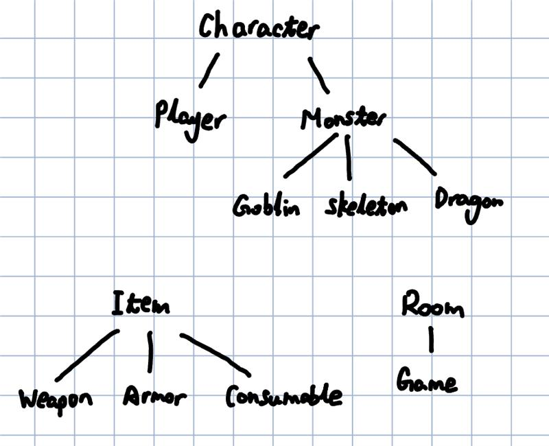

# ECE 312 - Lab 6 Write-Up

**Name:** Yifan Shi 
**EID:** ys27523  
**Date:** Dec 08, 2025

---

## 1. Design Decisions (3-4 sentences)

Briefly describe your key design choices and rationale:

- **Overall implementations:** How did you make use of object-oriented concepts in your decision?  Specifically, how did you use inheritance and polymorphism (if you did) and how did it help or complicate the design over using a language like C?  Draw a diagram showing the classes you used and their relationships to each other (subclass to superclass relationships specifically.) 

   For this project, I used an object-oriented design where `Character` serves as the base class, and `Player` and `Monster` derive from it to reuse shared combat logic such as HP, attack, defense, and damage calculation. Polymorphism is used heavily—`Item` is a base class with virtual functions overridden by `Weapon`, `Armor`, and `Consumable`, allowing the program to store different item types in the same container and handle them uniformly. This design is much cleaner than a C-style approach, since inheritance eliminates duplicated logic and polymorphism allows flexible behavior at runtime. The class hierarchy is shown below: (under fig/Class_Hierarchy.jpeg)

- **Memory management:** What strategy did you use to avoid leaks? Any particular challenges?

    For memory management, `Game` owns all rooms, each `Room` owns its items and monster, and each `Player` owns its inventory items. By deleting owned objects in destructors and ensuring ownership is transferred correctly (e.g., monster loot into rooms), I prevented leaks. 

---

## 2. Testing & Debugging (2-3 sentences)

Describe your testing process and any major bugs you encountered:

- **Testing approach:** What was your strategy beyond running `make test`?

        My testing strategy combined incremental manual testing (running individual components like Player, Monster, and Room test files) with full end-to-end testing inside the game loop, verifying movement, inventory, equipment, combat, and level-ups. I also used valgrind frequently to check for leaks and invalid deletes.

- **Most difficult bug:** What was the hardest bug to find/fix and how did you solve it?

---

## 3. Implementation Challenges (2-3 sentences)

Which TODOs were most challenging and why?

1. **Hardest TODO:** 
    Implementing the combat system.

2. **Most time-consuming:** 
    The Game command parser `processCommand`

3. **Most interesting:** 
    Building the world connections and room system.

---

## 4. Reflection (1-2 sentences)

What was the most valuable lesson from this lab?
    The most valuable lesson from this lab was understanding how object-oriented design and careful memory management interact in a large C++ project. I also learned how important it is to define clear ownership rules for dynamically allocated objects to avoid leaks and undefined behavior.

---

## Submission Checklist

- [ ] All functionality completed
- [ ] `make test` passes with no failures
- [ ] `make valgrind` shows no memory leaks
- [ ] Game fully functional 
- [ ] Code compiles without warnings (`-Wall -Wextra`)
- [ ] This write-up completed
- [ ] Optional Bonus attempted? (Yes/No): _____
